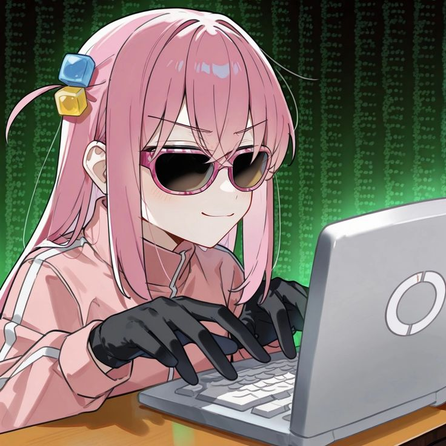

<h1 align="center">Self Hosting Bocchi 🎸🚀</h1>

<p align="center">
  
</p>

---

This guide will help you **how to run Bocchi** on your own instance locally or on a VM

---

## ⚙️ Requirements

**Node.js** 16.11.0 or higher
**MongoDB atlas** 
**pnpm** better than npm for performance

---

## 🚀 Installation

**Create a .env** file exactly like the example (.env.example).

**Fill in the environment variables correctly**.

``BOT_TOKEN=`` - **Token of your bot, get one [here](https://discord.com/developers/applications)**
``BOT_ID=`` - **just copy your bot’s ID from Discord**
``BOT_PREFIX=`` - **set the default bot prefix**
``OWNER_ID=`` - **just copy the ID of the bot owner**
``MONGO_URI=`` - **Required for features that store data, get one [here](https://www.mongodb.com/products/platform/atlas-database)**
``MONGO_DB_NAME=`` **Choose your preferred name for the database that will appear in MongoDB Atlas**
``GUILD_ID=`` - **Guild ID for deploying slash commands (usually used for development)**
``LOG_LEVEL=`` **Log level that will appear:** ``debug`` or ``info``

After filling in the environment variables correctly, run the steps below:

### Install dependencies
```bash
  pnpm install
```
### Start
```bash
  pnpm start
```